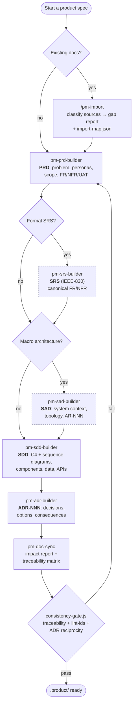

# pm-skills

A Claude Code marketplace containing the **product-design-suite** plugin — a set
of Agent Skills that guide Product Managers and architects through a sequential
**PRD → SRS → SAD → SDD → ADR** workflow, with cross-document synchronization,
requirement traceability, and framework-free HTML/Mermaid visualizations.

The SRS and SAD stages are **optional**: a small product can go straight from PRD
to SDD, while a team that maintains a formal IEEE-830 SRS or a macro System
Architecture Document can slot those in. Everything is written to a local
`.product/` directory as plain Markdown.

---

## What's inside

- **8 skills** orchestrating the full document workflow (below).
- **7 slash commands** (`/pm-product`, `/pm-prd`, `/pm-srs`, `/pm-sad`, `/pm-sdd`, `/pm-adr`, `/pm-import`).
- **Tooling scripts** for traceability, an ID linter, a consistency gate, and offline diagram/UI previews.
- **A canonical ID convention** shared by the templates and the tooling so requirement IDs never silently drift.

### Recent improvements

- **Canonical ID conventions** — one source of truth (`scripts/id-conventions.js` + `shared/references/id-conventions.md`) consumed by the traceability tool and the linter, so `FR-001`, category-lettered `NFR-P1`, and constraints `C-7` are all recognized consistently.
- **Smarter traceability** — structural parsing of the SAD/SDD *Architectural Requirements* table (Source column), a first-class **Constraints** group, and a report of any ID-shaped token it could not classify.
- **ID linter** (`scripts/lint-ids.js`) and a **consistency gate** (`scripts/consistency-gate.js`) that runs traceability + lint + ADR supersede/amend reciprocity in one pass/fail summary.
- **IEEE-830 SRS** and **System Architecture Document (SAD)** stages, each owning their canonical requirements (`FR/NFR` in the SRS, `AR-NNN` in the SAD).
- **`pm-import`** to bootstrap the suite from existing docs (emits a gap report + machine-readable `import-map.json` + `import-state.json`).
- **Front-matter & template polish** — ADR `related-srs` links, an optional mode-banner slot, and per-concern status fields (`designed | partial | gap | n/a`) in the SDD.
- **Lighter diagram preview** — render inline Mermaid to a single self-contained HTML file with no long-running server.

---

## Installation

The suite ships as a Claude Code **plugin** inside this **marketplace**. Choose
whichever path fits your setup.

### Option A — Claude Code marketplace + plugin (recommended)

From inside Claude Code:

```text
/plugin marketplace add vivaldomp/pm-skills
/plugin install product-design-suite@pm-skills
```

- The first command registers this GitHub repo as a marketplace named `pm-skills`.
- The second installs the `product-design-suite` plugin from it.
- Run `/plugin` any time to browse, enable/disable, or update installed plugins.

To point at a local clone instead of GitHub (useful while developing):

```text
/plugin marketplace add /absolute/path/to/pm-skills
/plugin install product-design-suite@pm-skills
```

### Option B — direct plugin install (alternative marketplace)

If you maintain your own marketplace list, add this entry by source and install
as above. The plugin lives at `plugins/product-design-suite` within the repo and
declares its manifest at `plugins/product-design-suite/.claude-plugin/plugin.json`.
The marketplace manifest is `.claude-plugin/marketplace.json`.

```text
/plugin marketplace add https://github.com/vivaldomp/pm-skills
/plugin install product-design-suite@pm-skills
```

### Option C — `npx skills` (skills CLI)

If you use the [`skills`](https://www.npmjs.com/package/skills) CLI to manage
Agent Skills directly (it copies `SKILL.md` files into `~/.claude/skills/`):

```bash
# Launch the interactive installer and pick the product-design-suite skills
npx skills

# …or install this repo's skills non-interactively
npx skills install vivaldomp/pm-skills
```

> The skills CLI installs the **skills** themselves. The slash commands and the
> bundled tooling scripts ship with the **plugin**, so for the full experience
> prefer Option A. Use the CLI when you only want the skill prompts available in
> any Claude Code session.

After installing by any method, verify with `/pm-product` or just ask Claude to
"start a PRD" — the skills are descriptive-triggered, so natural requests work too.

---

## Workflow



The **`pm-product-workflow`** skill is the orchestrator: it initializes
`.product/`, enforces the question cadence (gap-only questions, one confirmation
batch per builder), and dispatches to each builder in order. You can also invoke
any single stage on its own via its slash command.

---

## Skills

| Skill | Role |
| --- | --- |
| `pm-product-workflow` | **Orchestrator.** Runs the end-to-end PRD → (SRS) → (SAD) → SDD → ADR sequence, initializes `.product/`, enforces question cadence, and dispatches to the builders + doc-sync. |
| `pm-prd-builder` | Create/update the **PRD** — problem statement, personas, scope, functional/non-functional requirements, acceptance criteria. Writes `.product/prd/prd.md`. |
| `pm-srs-builder` | Create/update an **IEEE-830 SRS** owning canonical `FR-NNN`/`NFR-NNN`. Optional; the PRD then references it. Writes `.product/srs/srs.md`. |
| `pm-sad-builder` | Create/update a **System Architecture Document** — system context, container/infra topology, macro security, and Architectural Requirements `AR-NNN`. Optional; sits between SRS and SDD. Writes `.product/sad/sad.md`. |
| `pm-sdd-builder` | Create/update the **SDD** — C4 + sequence diagrams (inline Mermaid), components, data model, APIs, security, observability, testing. Writes `.product/sdd/sdd.md`. |
| `pm-adr-builder` | Record/update an **ADR** — a single decision with options, trade-offs, consequences, and status (proposed/accepted/superseded). Writes `.product/adr/ADR-NNN-*.md`. |
| `pm-doc-sync` | Propagate changes across PRD/SRS/SAD/SDD/ADR. Produces an impact report, refreshes the traceability matrix, and makes confirmation-gated edits. |
| `pm-import` | Bootstrap the suite from **existing** docs. Classifies sources, maps them to templates, and writes a gap report + `import-map.json` + `import-state.json` before any authoring. |

## Commands

| Command | Invokes |
| --- | --- |
| `/pm-product` | `pm-product-workflow` (full workflow) |
| `/pm-prd` | `pm-prd-builder` |
| `/pm-srs` | `pm-srs-builder` |
| `/pm-sad` | `pm-sad-builder` |
| `/pm-sdd` | `pm-sdd-builder` |
| `/pm-adr` | `pm-adr-builder` |
| `/pm-import` | `pm-import` |

Skills are also **descriptive-triggered** — phrases like "draft a PRD", "design
the architecture", or "record this decision" activate the right skill without a
command.

---

## Tooling scripts

Located in `plugins/product-design-suite/scripts/`. All are Node.js (standard
library only, no npm dependencies) or POSIX shell.

| Script | Purpose |
| --- | --- |
| `id-conventions.js` | **Single source of truth** for ID prefixes (`FR BR NFR AR UAT ADR C`) and member syntax (`FR-001`, category-lettered `NFR-P1`, sub-ids `FR-003a`). Imported by the tools below so they never disagree. |
| `traceability.js` | Builds the **requirement → SDD → ADR → UAT** traceability matrix, an Architectural-Requirements group (parsing the SAD/SDD *Source* column structurally), a **Constraints** group, an orphan/coverage report, and a list of unclassified ID-shaped tokens. Injects a coverage index into the SDD. Run: `node scripts/traceability.js .product`. |
| `lint-ids.js` | **ID linter** — flags identifiers that look like requirement IDs but don't match the canonical convention, plus IDs duplicated across files. Exit non-zero on violations. Run: `node scripts/lint-ids.js .product`. |
| `consistency-gate.js` | **Final gate** — runs traceability + `lint-ids` + ADR supersede/amend reciprocity + front-matter completeness and prints one pass/fail summary. Run: `node scripts/consistency-gate.js .product`. |
| `mermaid-preview.js` | Renders the inline Mermaid blocks of a Markdown file into a **single self-contained HTML** file (Mermaid vendored, works offline, no server). Run: `node scripts/mermaid-preview.js <draft.md> <out.html>`. |
| `openui-render.js` | Renders **OpenUI Lang** UI mockups to self-contained HTML (see `shared/references/openui-guide.md`). |
| `preview-server.cjs` | Minimal WebSocket **live-preview server** for iterating on diagrams/mockups in a browser. |
| `start-server.sh` / `stop-server.sh` | Start/stop the live preview server and report its connection info. |
| `helper.js` | Shared helpers used by the preview client/server (e.g. reconnect backoff). |
| `frame-template.html` | HTML frame used to host rendered previews. |
| `vendor/mermaid.min.js` | Vendored Mermaid library for offline diagram rendering. |

### Repo tooling

| Path | Purpose |
| --- | --- |
| `tools/validate-plugin.js` | Validates the plugin/marketplace manifests and structure. Run: `node tools/validate-plugin.js .` |

---

## Templates & references

**Templates** (`plugins/product-design-suite/shared/templates/`) — `prd-template.md`,
`srs-template.md`, `sad-template.md`, `sdd-template.md`, `adr-template.md`. Each
ships with YAML front-matter and (where relevant) a coverage-index marker and an
optional mode-banner slot.

**References** (`plugins/product-design-suite/shared/references/`):

| File | What it covers |
| --- | --- |
| `id-conventions.md` | The canonical ID specification — prefixes, category-lettered NFRs, constraints, range/list syntax. The human-readable companion to `id-conventions.js`. |
| `concepts.md` | Domain concepts the builders rely on. |
| `structures.md` | Document structures and traceability notation (ranges, orphans). |
| `questioning-protocol.md` | The question cadence and the one-confirmation-batch contract every builder follows. |
| `openui-guide.md` | OpenUI Lang authoring guide for UI mockups. |

---

## ID conventions

All requirement/decision/constraint identifiers follow one
[canonical convention](plugins/product-design-suite/shared/references/id-conventions.md):

```
<PREFIX>-[CATEGORY][NUMBER][suffix]
```

- Prefixes: `FR` `BR` `NFR` `AR` `UAT` `ADR` `C`.
- Optional 0–2 uppercase **category** letters (e.g. `NFR-P1`, `NFR-S4`).
- Optional lowercase **sub-id** suffix (e.g. `FR-003a`).
- Ranges/lists: `FR-001..FR-005`, `FR-036…042`, `FR-001/002/003a`.

Run `node scripts/lint-ids.js .product` to catch IDs that drift from this spec.

---

## Generated artifacts

The workflow writes everything under `.product/`:

```
.product/
├── prd/prd.md
├── srs/srs.md            # optional
├── sad/sad.md            # optional
├── sdd/sdd.md            # includes the generated coverage index
├── adr/ADR-NNN-*.md
├── diagrams/             # optional Mermaid/HTML exports
├── traceability.md / .html
├── import-gap-report.md  # when bootstrapped via pm-import
├── import-map.json
└── import-state.json
```

---

## Development

```bash
node tools/validate-plugin.js .   # validate plugin + marketplace manifests
node --test                        # run tests/*.test.js (Node >= 18)
node scripts/consistency-gate.js .product   # full cross-document gate (on a generated .product/)
```
