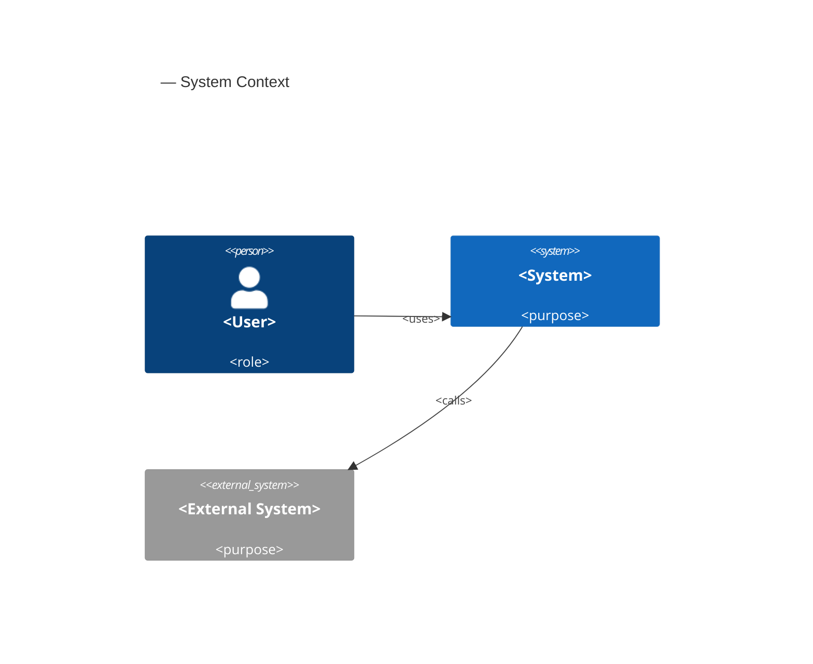
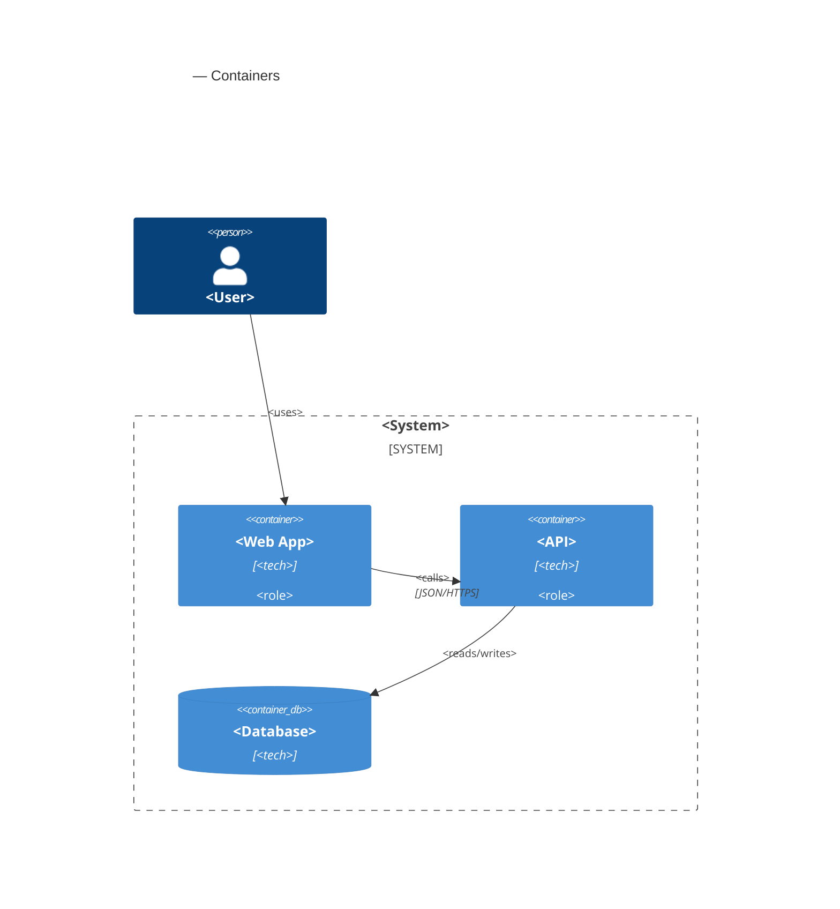
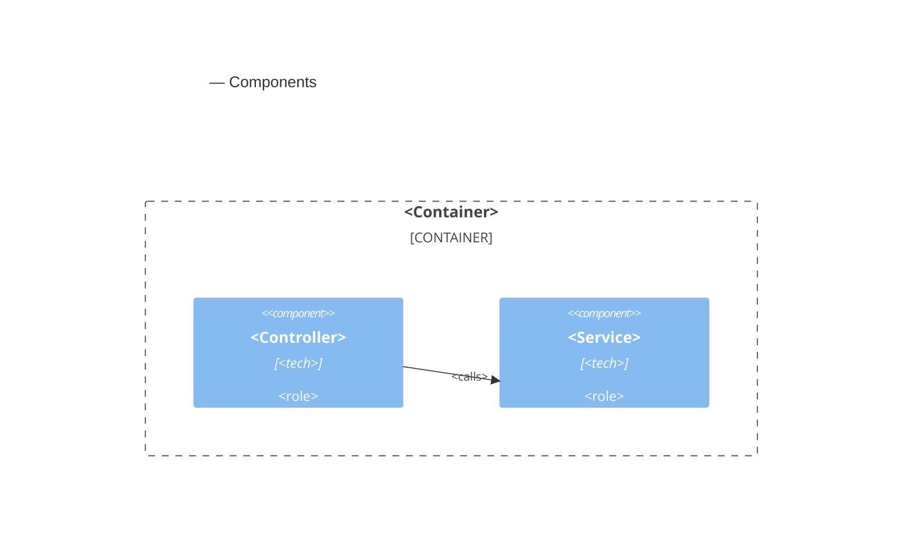
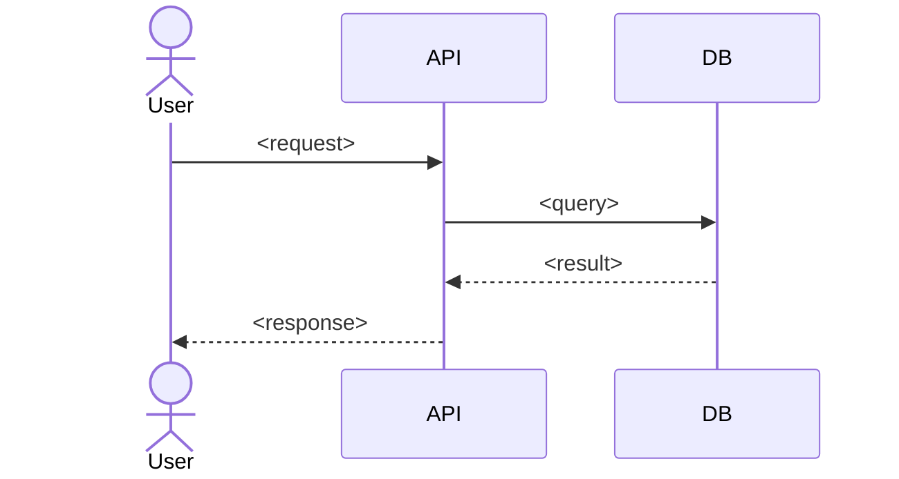
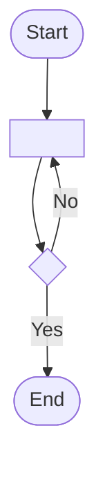
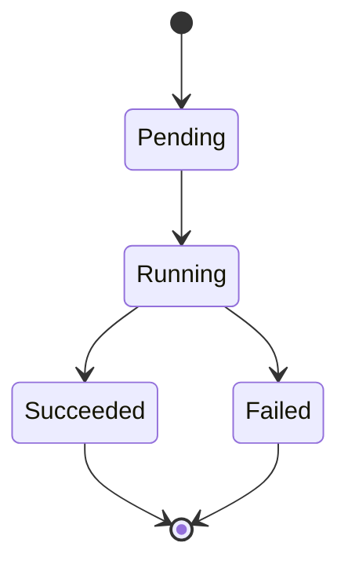

# Diagram Overhaul Implementation Plan

> **For agentic workers:** REQUIRED SUB-SKILL: Use superpowers:subagent-driven-development (recommended) or superpowers:executing-plans to implement this plan task-by-task. Steps use checkbox (`- [ ]`) syntax for tracking.

**Goal:** Replace the `product-design-suite` plugin's box-row SVG "C4" sketches with inline Mermaid diagrams authored into the SDD, recommended by system shape and approved before they're written.

**Architecture:** Diagrams become ` ```mermaid ` fenced blocks living inline in `sdd.md` (render natively on GitHub/VS Code, no build step). A new dependency-free `mermaid-preview.js` script generates a self-contained preview HTML (Mermaid vendored locally, no CDN) for the approval gate, served by the existing preview server. `diagram-render.js` is retired. `structures.md` gains an architecture-driven diagram catalog the SDD builder reasons over.

**Tech Stack:** Node.js ≥ 18 CommonJS scripts, `node:test` runner, vendored `mermaid.min.js` (static asset, not an npm dependency), Markdown skills/templates/references.

## Global Constraints

- **Runtime:** Node.js ≥ 18, CommonJS (`require`/`module.exports`). Repo Node is v24. No `package.json`; tests run with `node --test tests/`.
- **No new npm runtime dependencies.** Mermaid is vendored as a static file under `scripts/vendor/`, never declared as a dependency.
- **Self-contained output:** every generated HTML must pass `!/(src|href)=("|')https?:\/\//` — no external `http(s)` resources. Mermaid is inlined into a `<script>`, never loaded from a CDN.
- **Plugin paths in skills** use `${CLAUDE_PLUGIN_ROOT}/scripts/...`.
- **Diagram engine:** Mermaid only. No PlantUML/Structurizr.
- **Source of truth:** inline ` ```mermaid ` blocks in `sdd.md`. `.product/diagrams/` is an optional export target only.

---

### Task 1: `mermaid-preview.js` module + unit tests

**Files:**
- Create: `plugins/product-design-suite/scripts/mermaid-preview.js`
- Test: `tests/mermaid-preview.test.js`

**Interfaces:**
- Produces (CommonJS exports):
  - `extractMermaidBlocks(markdown: string) -> string[]` — inner source of every ` ```mermaid ` fenced block, in document order; `[]` when none.
  - `renderPreview(blocks: string[], opts?: { title?: string, mermaidJs?: string }) -> string` — self-contained preview HTML; `opts.mermaidJs` is inlined into a `<script>` (no external src); one `<pre class="mermaid">` per block; empty-state when `blocks` is empty.
  - CLI: `node mermaid-preview.js <input.md> <out.html>` — reads markdown, inlines `scripts/vendor/mermaid.min.js` if present, writes preview HTML.
- Consumed by: `tests/e2e-smoke.test.js` (Task 3) and `pm-sdd-builder` / `pm-product-workflow` skills (Task 6).

- [ ] **Step 1: Write the failing test**

Create `tests/mermaid-preview.test.js`:

```js
const test = require('node:test');
const assert = require('node:assert');
const m = require('../plugins/product-design-suite/scripts/mermaid-preview.js');

test('extractMermaidBlocks returns inner source of each mermaid fence in order', () => {
  const md = [
    '# Doc',
    '```mermaid',
    'flowchart TD',
    '  A --> B',
    '```',
    'prose',
    '```js',
    'const x = 1;',
    '```',
    '```mermaid',
    'sequenceDiagram',
    '  A->>B: hi',
    '```',
  ].join('\n');
  const blocks = m.extractMermaidBlocks(md);
  assert.equal(blocks.length, 2);
  assert.match(blocks[0], /flowchart TD/);
  assert.match(blocks[0], /A --> B/);
  assert.match(blocks[1], /sequenceDiagram/);
  assert.ok(!blocks.join('\n').includes('const x'));
});

test('extractMermaidBlocks returns [] when there are no diagrams', () => {
  assert.deepEqual(m.extractMermaidBlocks('# Just text\nno fences here'), []);
});

test('renderPreview inlines provided mermaid js, one figure per block, no external resources', () => {
  const html = m.renderPreview(['flowchart TD\n A-->B', 'stateDiagram-v2\n [*] --> S'], { mermaidJs: '/*MERMAID-LIB*/' });
  assert.match(html, /<!DOCTYPE html>/);
  assert.match(html, /\/\*MERMAID-LIB\*\//);
  assert.equal((html.match(/class="mermaid"/g) || []).length, 2);
  assert.match(html, /mermaid\.initialize/);
  assert.ok(!/(src|href)=("|')https?:\/\//.test(html));
});

test('renderPreview escapes html-special chars in diagram source', () => {
  const html = m.renderPreview(['flowchart TD\n A[<b>x</b>] --> B'], { mermaidJs: '' });
  assert.ok(!html.includes('<b>x</b>'));
  assert.match(html, /&lt;b&gt;/);
});

test('renderPreview shows an empty-state when given no blocks', () => {
  const html = m.renderPreview([], { mermaidJs: '' });
  assert.match(html, /No mermaid diagrams found/);
});
```

- [ ] **Step 2: Run test to verify it fails**

Run: `node --test tests/mermaid-preview.test.js`
Expected: FAIL — `Cannot find module '.../mermaid-preview.js'`

- [ ] **Step 3: Write minimal implementation**

Create `plugins/product-design-suite/scripts/mermaid-preview.js`:

```js
const fs = require('node:fs');
const path = require('node:path');

const VENDOR_MERMAID = path.join(__dirname, 'vendor', 'mermaid.min.js');

function esc(s) {
  return String(s == null ? '' : s).replace(/[&<>]/g, c => ({ '&': '&amp;', '<': '&lt;', '>': '&gt;' }[c]));
}

// Inner source of every ```mermaid fenced block, in document order.
function extractMermaidBlocks(markdown) {
  const re = /```mermaid[ \t]*\r?\n([\s\S]*?)```/g;
  const out = [];
  let mm;
  while ((mm = re.exec(String(markdown || ''))) !== null) {
    out.push(mm[1].replace(/\s+$/, ''));
  }
  return out;
}

// Self-contained preview page. mermaidJs is inlined (no external src), so the
// page renders offline / in restricted networks.
function renderPreview(blocks, opts = {}) {
  const title = opts.title || 'Diagram Preview';
  // Guard against a stray </script> inside the minified lib closing the tag early.
  const mermaidJs = String(opts.mermaidJs || '').replace(/<\/script>/gi, '<\\/script>');
  const figures = (blocks || []).length
    ? blocks.map((code, i) =>
        `<figure><figcaption>Diagram ${i + 1}</figcaption>` +
        `<pre class="mermaid">${esc(code)}</pre></figure>`).join('\n')
    : '<p class="empty">No mermaid diagrams found.</p>';
  return `<!DOCTYPE html><html><head><meta charset="utf-8"><title>${esc(title)}</title>` +
    `<style>body{font-family:system-ui,sans-serif;margin:2rem;background:#fff}` +
    `h1{font-size:1.2rem}figure{margin:0 0 2rem}` +
    `figcaption{font-size:.8rem;color:#666;margin-bottom:.4rem}.empty{color:#666}</style>` +
    `</head><body><h1>${esc(title)}</h1>${figures}` +
    `<script>${mermaidJs}</script>` +
    `<script>mermaid.initialize({startOnLoad:true});</script>` +
    `</body></html>`;
}

module.exports = { extractMermaidBlocks, renderPreview };

if (require.main === module) {
  const [inPath, outPath] = process.argv.slice(2);
  if (!inPath || !outPath) {
    console.error('usage: mermaid-preview.js <input.md> <out.html>');
    process.exit(1);
  }
  const markdown = fs.readFileSync(inPath, 'utf8');
  const mermaidJs = fs.existsSync(VENDOR_MERMAID) ? fs.readFileSync(VENDOR_MERMAID, 'utf8') : '';
  const blocks = extractMermaidBlocks(markdown);
  fs.writeFileSync(outPath, renderPreview(blocks, { title: path.basename(inPath), mermaidJs }));
  console.log(`Wrote ${outPath} (${blocks.length} diagram${blocks.length === 1 ? '' : 's'})`);
}
```

- [ ] **Step 4: Run test to verify it passes**

Run: `node --test tests/mermaid-preview.test.js`
Expected: PASS — 5 tests pass.

- [ ] **Step 5: Commit**

```bash
git add plugins/product-design-suite/scripts/mermaid-preview.js tests/mermaid-preview.test.js
git commit -m "feat: add mermaid-preview script (extract fences + self-contained preview)"
```

---

### Task 2: Vendor the Mermaid library + asset/CLI tests

**Files:**
- Create: `plugins/product-design-suite/scripts/vendor/mermaid.min.js` (vendored, pinned)
- Test: `tests/mermaid-preview.test.js` (extend)

**Interfaces:**
- Consumes: `mermaid-preview.js` CLI and `VENDOR_MERMAID` path from Task 1.
- Produces: a committed static `mermaid.min.js` (UMD build) that the CLI inlines.

- [ ] **Step 1: Write the failing tests**

Append to `tests/mermaid-preview.test.js`:

```js
const fs = require('node:fs');
const os = require('node:os');
const path = require('node:path');
const { execFileSync } = require('node:child_process');

const VENDOR = path.join(__dirname, '..', 'plugins/product-design-suite/scripts/vendor/mermaid.min.js');
const CLI = path.join(__dirname, '..', 'plugins/product-design-suite/scripts/mermaid-preview.js');

test('vendored mermaid asset is present and substantial', () => {
  assert.ok(fs.existsSync(VENDOR), 'vendor/mermaid.min.js must exist');
  assert.ok(fs.statSync(VENDOR).size > 100000, 'vendored mermaid should be > 100KB');
});

test('CLI renders a self-contained preview from a markdown file', () => {
  const dir = fs.mkdtempSync(path.join(os.tmpdir(), 'mmd-'));
  const md = path.join(dir, 'in.md');
  const out = path.join(dir, 'out.html');
  fs.writeFileSync(md, '```mermaid\nflowchart TD\n A-->B\n```\n');
  execFileSync('node', [CLI, md, out]);
  const html = fs.readFileSync(out, 'utf8');
  assert.match(html, /<!DOCTYPE html>/);
  assert.match(html, /class="mermaid"/);
  assert.ok(!/(src|href)=("|')https?:\/\//.test(html));
});
```

- [ ] **Step 2: Run tests to verify they fail**

Run: `node --test tests/mermaid-preview.test.js`
Expected: FAIL — `vendor/mermaid.min.js must exist`.

- [ ] **Step 3: Vendor the asset**

Fetch a pinned Mermaid 11.x UMD build and place it at the vendor path (run from repo root):

```bash
mkdir -p plugins/product-design-suite/scripts/vendor
cd "$(mktemp -d)" && npm pack mermaid@11 2>/dev/null
tar -xzf mermaid-*.tgz
# UMD build that exposes global `mermaid` and supports mermaid.initialize:
cp package/dist/mermaid.min.js "$OLDPWD/plugins/product-design-suite/scripts/vendor/mermaid.min.js"
cd "$OLDPWD"
# Record the exact resolved version for provenance:
node -e "console.log(require('child_process').execSync('npm view mermaid@11 version').toString().trim())" \
  > plugins/product-design-suite/scripts/vendor/MERMAID_VERSION.txt
ls -la plugins/product-design-suite/scripts/vendor/
```

If `package/dist/mermaid.min.js` is absent in the packed tarball, use `package/dist/mermaid.js` (the non-minified UMD) instead — the only requirement is a UMD bundle exposing a global `mermaid` with `initialize`. Confirm the file is > 100 KB.

- [ ] **Step 4: Run tests to verify they pass**

Run: `node --test tests/mermaid-preview.test.js`
Expected: PASS — all 7 tests pass (5 from Task 1 + 2 here).

- [ ] **Step 5: Commit**

```bash
git add plugins/product-design-suite/scripts/vendor/ tests/mermaid-preview.test.js
git commit -m "feat: vendor pinned mermaid.min.js for offline diagram preview"
```

---

### Task 3: Retire `diagram-render.js` and migrate the e2e smoke test

**Files:**
- Delete: `plugins/product-design-suite/scripts/diagram-render.js`
- Delete: `tests/diagram-render.test.js`
- Modify: `tests/e2e-smoke.test.js:8,27`

**Interfaces:**
- Consumes: `mermaid-preview.js` exports (Task 1).
- Produces: no remaining live `require` of `diagram-render.js` anywhere outside `docs/`.

- [ ] **Step 1: Update the e2e smoke test to the new module**

In `tests/e2e-smoke.test.js`, replace line 8:

```js
const d = require('../plugins/product-design-suite/scripts/diagram-render.js');
```

with:

```js
const d = require('../plugins/product-design-suite/scripts/mermaid-preview.js');
```

Then replace the diagram line inside the `'renderers produce self-contained html'` test (line 27):

```js
  const dg = d.renderDiagram({ title: 'X', nodes: [{ id: 'a', label: 'A' }], edges: [] });
```

with:

```js
  const dg = d.renderPreview(d.extractMermaidBlocks('```mermaid\nflowchart TD\n A-->B\n```'), { mermaidJs: '/*m*/' });
```

(The surrounding assertions — `<!DOCTYPE html>` and no external `http(s)` — stay unchanged and still hold.)

- [ ] **Step 2: Delete the retired script and its test**

```bash
git rm plugins/product-design-suite/scripts/diagram-render.js tests/diagram-render.test.js
```

- [ ] **Step 3: Run the affected tests to verify green**

Run: `node --test tests/e2e-smoke.test.js tests/mermaid-preview.test.js`
Expected: PASS — no module-not-found, all tests pass.

- [ ] **Step 4: Verify no live references remain**

Run: `grep -rn "diagram-render" --include="*.js" --include="*.cjs" --include="*.md" plugins tests tools`
Expected: no matches under `plugins/`, `tests/`, or `tools/` (matches under `docs/` are historical and out of scope). The `pm-sdd-builder` reference at step 4 of its SKILL is removed in Task 6 — note it here and confirm it's gone after Task 6.

- [ ] **Step 5: Commit**

```bash
git add tests/e2e-smoke.test.js
git commit -m "refactor: retire diagram-render.js; migrate e2e smoke to mermaid-preview"
```

---

### Task 4: Inline Mermaid stubs in the SDD template

**Files:**
- Modify: `plugins/product-design-suite/shared/templates/sdd-template.md` (§3 Architecture Overview, §7 Flows and Behavior)
- Test: `tests/diagram-conventions.test.js` (create)

**Interfaces:**
- Produces: SDD template whose diagram sections are ` ```mermaid ` fenced examples instead of `<Insert or reference ...>` placeholders. Verified by `tests/diagram-conventions.test.js`.

- [ ] **Step 1: Write the failing test**

Create `tests/diagram-conventions.test.js`:

```js
const test = require('node:test');
const assert = require('node:assert');
const fs = require('node:fs');
const path = require('node:path');

const ROOT = path.join(__dirname, '..', 'plugins/product-design-suite');
const read = p => fs.readFileSync(path.join(ROOT, p), 'utf8');

test('sdd-template uses inline mermaid for C4 and sequence diagrams', () => {
  const t = read('shared/templates/sdd-template.md');
  assert.match(t, /```mermaid/);
  assert.match(t, /C4Container/);
  assert.match(t, /sequenceDiagram/);
  assert.match(t, /stateDiagram-v2/);
  // The old HTML-render placeholder phrasing is gone:
  assert.ok(!/Insert or reference the C4 context diagram/.test(t));
});
```

- [ ] **Step 2: Run test to verify it fails**

Run: `node --test tests/diagram-conventions.test.js`
Expected: FAIL — `t` still contains the old placeholder / lacks `C4Container`.

- [ ] **Step 3: Edit the template — §3 Architecture Overview**

In `sdd-template.md`, replace the block from `### System Context Diagram` through the end of `### C4 Component Diagram` (the ```text ASCII box plus the three `<Insert or reference ...>` lines) with:

````markdown
### System Context Diagram



### C4 Container Diagram



### C4 Component Diagram


````

(Leave `### Deployment Landscape`, `### Runtime View`, and `### Major Design Decisions` unchanged.)

- [ ] **Step 4: Edit the template — §7 Flows and Behavior**

Replace the `### Sequence Diagrams`, `### Activity Diagrams`, and `### State Diagrams` placeholder bodies with inline stubs:

````markdown
### Sequence Diagrams



### Activity Diagrams



### State Diagrams


````

(Leave `### Orchestration`, `### Failure Flows`, `### Recovery Flows` unchanged.)

- [ ] **Step 5: Run test to verify it passes**

Run: `node --test tests/diagram-conventions.test.js`
Expected: PASS.

- [ ] **Step 6: Commit**

```bash
git add plugins/product-design-suite/shared/templates/sdd-template.md tests/diagram-conventions.test.js
git commit -m "feat: inline mermaid C4/sequence/state stubs in SDD template"
```

---

### Task 5: Diagram archetype catalog + folder guidance in `structures.md`

**Files:**
- Modify: `plugins/product-design-suite/shared/references/structures.md` (add catalog after the SDD quality checklist; fix §4 diagrams subfolders)
- Test: `tests/diagram-conventions.test.js` (extend)

**Interfaces:**
- Produces: a "Diagram archetypes (Mermaid)" catalog the SDD builder reasons over (Task 6), and a repo-structure note matching inline-first behavior.

- [ ] **Step 1: Write the failing test**

Append to `tests/diagram-conventions.test.js`:

```js
test('structures.md ships a mermaid diagram archetype catalog', () => {
  const s = read('shared/references/structures.md');
  assert.match(s, /Diagram archetypes \(Mermaid\)/);
  assert.match(s, /C4Container/);
  assert.match(s, /sequenceDiagram/);
  assert.match(s, /erDiagram/);
  assert.match(s, /trust boundary/i);
  // expanded export subfolders documented:
  assert.match(s, /state\//);
});
```

- [ ] **Step 2: Run test to verify it fails**

Run: `node --test tests/diagram-conventions.test.js`
Expected: FAIL — catalog text not present.

- [ ] **Step 3: Add the catalog**

In `structures.md`, immediately after the `### SDD quality checklist` list (before `## 3. ADR (Architecture Decision Record)`), insert:

````markdown
### Diagram archetypes (Mermaid)

Diagrams are authored as inline Mermaid fenced blocks in the SDD, so they render
in GitHub/GitLab/VS Code/IDEs with no build step. Choose diagrams by the system's
shape, not a fixed C4 default. The SDD builder reads the PRD/SDD and recommends a
set from this catalog:

| Archetype | Mermaid kind | Recommend when |
| --- | --- | --- |
| C4 Context | `C4Context` | always — system boundary and external actors |
| C4 Container | `C4Container` | multi-container / multi-service systems |
| C4 Component | `C4Component` | a container with nontrivial internal structure |
| Sequence | `sequenceDiagram` | auth handshakes, multi-step protocols (e.g. a gated-install 401-abort) |
| State machine | `stateDiagram-v2` | background jobs, export/install lifecycles, run states |
| ER / data | `erDiagram` | multi-entity data models, multiple datastores |
| Deployment | `C4Deployment` or `flowchart` | multiple runtime environments / infra topology |
| DFD + trust boundary | `flowchart` with `subgraph` boundaries | privacy/security/LGPD review, data crossing trust zones |
| Flow / activity | `flowchart` | general process or branching logic |
````

- [ ] **Step 4: Fix the repository-structure diagrams note**

In `structures.md` §4, replace the `diagrams/` block:

```text
|-- diagrams/
|   |-- c4/
|   |-- sequence/
|   |-- deployment/
|   `-- domain/
```

with:

```text
|-- diagrams/            # optional exports; inline mermaid in the SDD is the source of truth
|   |-- c4/
|   |-- sequence/
|   |-- state/
|   |-- data/
|   |-- deployment/
|   `-- flow/
```

- [ ] **Step 5: Run test to verify it passes**

Run: `node --test tests/diagram-conventions.test.js`
Expected: PASS.

- [ ] **Step 6: Commit**

```bash
git add plugins/product-design-suite/shared/references/structures.md tests/diagram-conventions.test.js
git commit -m "feat: add mermaid diagram archetype catalog; align diagrams folder guidance"
```

---

### Task 6: Rework the SDD builder + workflow preview step

**Files:**
- Modify: `plugins/product-design-suite/skills/pm-sdd-builder/SKILL.md` (frontmatter description + step 4)
- Modify: `plugins/product-design-suite/skills/pm-product-workflow/SKILL.md` (preview step)
- Test: `tests/diagram-conventions.test.js` (extend)

**Interfaces:**
- Consumes: `mermaid-preview.js` (Task 1), the catalog in `structures.md` (Task 5).
- Produces: SDD builder that recommends → drafts → previews → approves → writes inline Mermaid; no remaining reference to `diagram-render.js`.

- [ ] **Step 1: Write the failing test**

Append to `tests/diagram-conventions.test.js`:

```js
test('pm-sdd-builder uses mermaid-preview and inline diagrams, not diagram-render', () => {
  const s = read('skills/pm-sdd-builder/SKILL.md');
  assert.match(s, /mermaid-preview\.js/);
  assert.match(s, /inline/i);
  assert.ok(!/diagram-render/.test(s));
});

test('pm-product-workflow preview step references mermaid-preview', () => {
  const w = read('skills/pm-product-workflow/SKILL.md');
  assert.match(w, /mermaid-preview\.js/);
});
```

- [ ] **Step 2: Run test to verify it fails**

Run: `node --test tests/diagram-conventions.test.js`
Expected: FAIL — `pm-sdd-builder` still references `diagram-render`.

- [ ] **Step 3: Update `pm-sdd-builder` frontmatter description**

Replace the `description:` line (line 3) so it no longer implies HTML-rendered diagrams:

```yaml
description: Create or update a Software Design Document (SDD). Use when the user wants to design the technical solution, architecture, C4 diagrams, components, data model, APIs, security, observability, or testing strategy derived from a PRD. Writes .product/sdd/sdd.md with inline Mermaid diagrams (and optional exports to .product/diagrams/).
```

- [ ] **Step 4: Replace step 4 of `pm-sdd-builder`**

Replace the current step 4 (the `Render diagrams as self-contained HTML ...` block referencing `diagram-render.js`) with:

````markdown
4. Author diagrams as **inline Mermaid** in `sdd.md`:
   - **Recommend a set.** Read the PRD/SDD and pick diagram archetypes from the
     catalog in `${CLAUDE_PLUGIN_ROOT}/shared/references/structures.md`
     ("Diagram archetypes (Mermaid)"), driven by the system's shape — e.g. auth
     handshake → `sequenceDiagram`, background jobs → `stateDiagram-v2`,
     privacy/LGPD data crossing zones → `flowchart` DFD with `subgraph` trust
     boundaries, multi-store → `erDiagram`/deployment. Present the recommended set
     with a one-line rationale each and let the user confirm or adjust.
   - **Draft** Mermaid source for each chosen type (`C4Context`/`C4Container`/
     `C4Component`, `sequenceDiagram`, `stateDiagram-v2`, `erDiagram`, `flowchart`).
   - **Present for approval.** Show the Mermaid source in the conversation, and
     offer a rendered preview: write the drafts to a scratch markdown file and run
     `node "${CLAUDE_PLUGIN_ROOT}/scripts/mermaid-preview.js" <scratch.md> <preview.html>`,
     served via the preview server (`start-server.sh`). Mermaid is vendored
     locally, so the preview works offline. Iterate until the user approves.
   - **Write** the approved ` ```mermaid ` blocks inline into the relevant `sdd.md`
     sections (§3 Architecture Overview, §7 Flows and Behavior). These inline blocks
     are the source of truth.
   - **Optionally export** standalone files to `.product/diagrams/{c4,sequence,state,data,deployment,flow}/`
     only if the user wants separate artifacts.
````

- [ ] **Step 5: Update the `pm-product-workflow` preview step**

In `pm-product-workflow/SKILL.md`, in the `**Preview (optional)**` step, add that diagram previews are generated with `mermaid-preview.js`. Replace the step body with:

````markdown
5. **Preview (optional)** during iteration: start the live preview server with
   `bash "${CLAUDE_PLUGIN_ROOT}/scripts/start-server.sh"`. Render SDD diagrams for
   review by extracting their inline Mermaid into a self-contained page —
   `node "${CLAUDE_PLUGIN_ROOT}/scripts/mermaid-preview.js" .product/sdd/sdd.md <content>/sdd-diagrams.html`
   — and OpenUI mockups via `openui-render.js`.
````

- [ ] **Step 6: Run test to verify it passes**

Run: `node --test tests/diagram-conventions.test.js`
Expected: PASS — all conventions tests green.

- [ ] **Step 7: Commit**

```bash
git add plugins/product-design-suite/skills/pm-sdd-builder/SKILL.md plugins/product-design-suite/skills/pm-product-workflow/SKILL.md tests/diagram-conventions.test.js
git commit -m "feat: SDD builder recommends + previews inline mermaid diagrams"
```

---

### Task 7: Full-suite verification

**Files:**
- No source changes — verification only.

- [ ] **Step 1: Run the entire test suite**

Run: `node --test tests/`
Expected: PASS — every suite green (`validate-plugin`, `traceability`, `openui-render`, `preview-server`, `e2e-smoke`, `mermaid-preview`, `diagram-conventions`). No `diagram-render` suite remains.

- [ ] **Step 2: Confirm no stale references outside docs**

Run: `grep -rn "diagram-render" plugins tests tools`
Expected: no output.

- [ ] **Step 3: Confirm the plugin still validates**

Run: `node --test tests/validate-plugin.test.js`
Expected: PASS.

- [ ] **Step 4: Final commit (if any verification fixes were needed)**

```bash
git add -A
git commit -m "test: verify diagram overhaul suite is green" --allow-empty
```

---

## Self-Review

**Spec coverage:**
- **B1 (Mermaid renderer):** Task 1 (`mermaid-preview.js`), Task 2 (vendored Mermaid), Task 4 (inline stubs in template). ✓
- **B2 (review/approval gate + engine pref):** Task 6 step 4 (recommend → draft → preview → approve → write loop; Mermaid-only "which types" selection). ✓
- **B3 (architecture-appropriate catalog):** Task 5 (catalog in `structures.md`), Task 6 (builder reasons over it). ✓
- **B10 (folder structure alignment):** Task 5 step 4 (expanded `diagrams/` subfolders, inline-as-source-of-truth note), Task 6 (optional export to subfolders). ✓
- **Retire old renderer:** Task 3. ✓
- **Tests rewritten / preserved self-contained guarantee:** Tasks 1–4 keep the `!/(src|href)=https?://` assertion. ✓

**Placeholder scan:** Angle-bracket tokens like `<System>` are intentional template fill-ins inside the SDD template, not plan placeholders; every code/edit step shows concrete content. No "TBD/TODO/handle edge cases". ✓

**Type consistency:** `extractMermaidBlocks` and `renderPreview(blocks, opts)` are named identically in Task 1 (definition), Task 2 (CLI test), Task 3 (e2e migration), and Task 6 (skill usage). `opts.mermaidJs` is the inlined-lib parameter throughout. ✓
