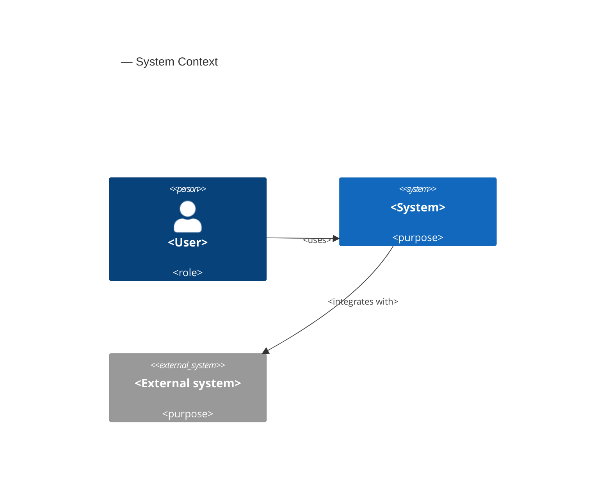
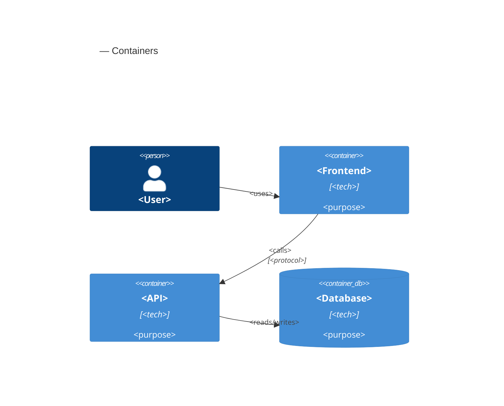
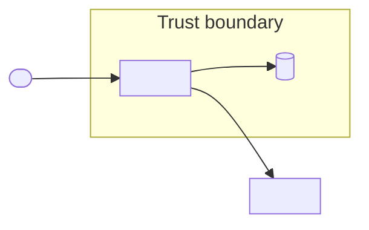

# SAD Support Implementation Plan

> **For agentic workers:** REQUIRED SUB-SKILL: Use superpowers:subagent-driven-development (recommended) or superpowers:executing-plans to implement this plan task-by-task. Steps use checkbox (`- [ ]`) syntax for tracking.

**Goal:** Add a first-class, opt-in System Architecture Document (SAD) to the `product-design-suite` plugin, slotting between SRS and SDD and owning the macro-architecture layer (C4 Context/Container, infra, data-flow, macro security) plus the `AR-NNN` table.

**Architecture:** SAD mode is detected purely by the existence of `.product/sad/sad.md` (mirroring the SRS keystone). A new `sad-template.md`, a `pm-sad-builder` skill + `/pm-sad` command, a SAD-mode branch in `pm-sdd-builder`, workflow re-sequencing, a SAD-aware `traceability.js`, and doc-sync/import/ADR/concepts/structures wiring. Conventions are locked by a new `tests/sad-conventions.test.js` and an extended `tests/traceability.test.js`.

**Tech Stack:** Markdown skills/templates/commands; Node.js `node:test` for conventions and unit tests; inline Mermaid for diagrams (no new dependency).

## Global Constraints

- **Opt-in / backward-compatible:** projects without `.product/sad/sad.md` behave exactly as today. The no-SAD path through `traceability.js` must stay byte-identical (default arg `sad = ''`).
- **Mode keystone:** SAD mode is detected only by `.product/sad/sad.md` existence — no stored flag, no config.
- **SAD owns (when present):** C4 Context (C1) + Container (C2) diagrams, system boundaries, tech/infra choices, data-flow & integration patterns, macro security architecture, and the canonical `AR-NNN` table. The SDD drops to C3 component/code level and references the SAD.
- **No new runtime dependency or parsing script** beyond editing the existing `traceability.js`. Mapping stays skill-driven.
- **No silent rewrites:** the SDD→SAD migration is confirmation-gated (propose-then-apply).
- **`FR`/`NFR`/`BR`/`UAT` do not move.** Only `AR` relocates (SDD → SAD when present).
- **`name == dir`** for the new skill (enforced by `validate-plugin.test.js`).
- Front-matter on every template/skill: `title`/`status`/`version`/`owner`/`date` for templates; `name`/`description` (+ `metadata.author`/`metadata.version`) for skills.
- Run the full suite with `node --test tests/*.test.js` from the repo root. All Phase 1–5 suites must keep passing.

---

### Task 1: `sad-template.md` + conventions test (template portion)

**Files:**
- Create: `plugins/product-design-suite/shared/templates/sad-template.md`
- Create (test): `tests/sad-conventions.test.js`

**Interfaces:**
- Consumes: nothing (first task).
- Produces: `shared/templates/sad-template.md` with sections `## 1. Introduction`, `## 2. Architectural Drivers and Requirements` (canonical `AR-NNN` table, columns `ID | Requirement | Source | Design Impact`), `## 3. System Context` (inline `C4Context`), `## 4. Container and Infrastructure`, `## 5. Data Flow and Integration Patterns`, `## 6. Security and Compliance Architecture`, `## 7. Architecture Decisions`, `## 8. Open Questions and Assumptions`. The `AR` table columns match the SDD §3 `AR` table so migration is a verbatim row lift.

- [ ] **Step 1: Write the failing test**

Create `tests/sad-conventions.test.js`:

```js
const test = require('node:test');
const assert = require('node:assert');
const fs = require('node:fs');
const path = require('node:path');

const root = path.join(__dirname, '..', 'plugins', 'product-design-suite');
const read = p => fs.readFileSync(path.join(root, p), 'utf8');

function frontMatter(text) {
  const m = text.match(/^---\n([\s\S]*?)\n---/);
  return m ? m[1] : null;
}

test('sad-template has front-matter with the five metadata fields', () => {
  const text = read('shared/templates/sad-template.md');
  assert.ok(text.startsWith('---\n'), 'sad-template must start with front-matter');
  const fm = frontMatter(text);
  assert.ok(fm, 'sad-template must have a closing --- delimiter');
  for (const key of ['title', 'status', 'version', 'owner', 'date']) {
    assert.match(fm, new RegExp('^' + key + ':', 'm'), `sad front-matter needs ${key}`);
  }
});

test('sad-template documents the AR table and C4/architecture sections', () => {
  const s = read('shared/templates/sad-template.md');
  assert.match(s, /## 1\. Introduction/);
  assert.match(s, /## 2\. Architectural Drivers and Requirements/);
  assert.match(s, /## 3\. System Context/);
  assert.match(s, /## 4\. Container and Infrastructure/);
  assert.match(s, /## 5\. Data Flow and Integration Patterns/);
  assert.match(s, /## 6\. Security and Compliance Architecture/);
  assert.match(s, /AR-001/);
  assert.match(s, /C4Context/);
});
```

- [ ] **Step 2: Run test to verify it fails**

Run: `node --test tests/sad-conventions.test.js`
Expected: FAIL — `ENOENT ... sad-template.md` (file does not exist yet).

- [ ] **Step 3: Create the template**

Create `plugins/product-design-suite/shared/templates/sad-template.md`:

```markdown
---
title: <System or Initiative Name>
status: <Draft | In Review | Approved | Superseded>
version: <semver, e.g. 0.1.0>
owner: <Name or team>
date: <YYYY-MM-DD>
---

# SAD: <System or Initiative Name>

## 1. Introduction

### Purpose

<State the purpose of this System Architecture Document and the system it describes.>

### Scope

<Define the macro-architecture this document covers and what it does not (code-level design lives in the SDD).>

### Audience

<Identify the readers: architects, engineering leads, security, platform, operations, product.>

### References

| Reference | Description | Link or Location |
| --- | --- | --- |
| PRD | Product Requirements Document | .product/prd/prd.md |
| SRS | Software Requirements Specification (if used) | .product/srs/srs.md |
| <Reference> | <Description> | <Link> |

### Related ADRs

- <ADR-001: Title>
- <ADR-002: Title>

### Glossary

| Term | Meaning |
| --- | --- |
| <Term> | <Definition> |

## 2. Architectural Drivers and Requirements

### Architectural Drivers

- <Driver 1, sourced from SRS/PRD non-functional requirements: scalability, reliability, security, cost, compliance, time-to-market>
- <Driver 2>

### Architectural Requirements

| ID | Requirement | Source | Design Impact |
| --- | --- | --- | --- |
| AR-001 | <Requirement> | <PRD/SRS/ADR/stakeholder> | <Impact> |
| AR-002 | <Requirement> | <Source> | <Impact> |

### Technical Constraints

- <Constraint 1>
- <Constraint 2>

## 3. System Context

A high-level (C4 Level 1) view of how the system interacts with users and external third-party systems.



## 4. Container and Infrastructure

A C4 Level 2 view of the major containers, their technology choices, and the deployment landscape.



### Technology Choices

| Concern | Choice | Notes / linked ADR |
| --- | --- | --- |
| <Concern> | <Choice> | <ADR-NNN> |

## 5. Data Flow and Integration Patterns

Describe how containers communicate (REST / GraphQL / gRPC / async event-driven messaging) and how data moves between systems. Use a data-flow diagram with trust boundaries where privacy/security review warrants it.



## 6. Security and Compliance Architecture

Macro-level security posture (implementation-level controls live in SDD §8 Security and Compliance):

- **Authentication:** <model, e.g. OAuth2 / OIDC / JWT>
- **Authorization:** <coarse-grained model, e.g. RBAC at the gateway>
- **Encryption:** <in transit / at rest posture>
- **Network perimeters:** <segmentation, ingress/egress, trust zones>
- **Compliance boundaries:** <data residency, regulatory scope>

## 7. Architecture Decisions

Structural choices made in this SAD, each linking to its ADR for the rationale.

| Decision | Choice | Rationale (ADR) |
| --- | --- | --- |
| <Decision> | <Choice> | <ADR-NNN> |

## 8. Open Questions and Assumptions

| Item | Type | Owner | Status |
| --- | --- | --- | --- |
| <Assumption or question> | <Assumption/question> | <Owner> | <Open/resolved> |
```

- [ ] **Step 4: Run test to verify it passes**

Run: `node --test tests/sad-conventions.test.js`
Expected: PASS (2 tests pass).

- [ ] **Step 5: Commit**

```bash
git add plugins/product-design-suite/shared/templates/sad-template.md tests/sad-conventions.test.js
git commit -m "feat: sad-template + conventions test (SAD support, Task 1)"
```

---

### Task 2: `pm-sad-builder` skill + `/pm-sad` command

**Files:**
- Create: `plugins/product-design-suite/skills/pm-sad-builder/SKILL.md`
- Create: `plugins/product-design-suite/commands/pm-sad.md`
- Modify: `tests/sad-conventions.test.js` (append builder + command assertions)

**Interfaces:**
- Consumes: `sad-template.md` (Task 1).
- Produces: skill `name: pm-sad-builder` that authors `.product/sad/sad.md`, owns `AR-NNN`, documents `derive-then-confirm` and the confirmation-gated SDD→SAD migration; command `commands/pm-sad.md` routing to it.

- [ ] **Step 1: Write the failing test**

Append to `tests/sad-conventions.test.js`:

```js
test('pm-sad-builder skill exists with valid front-matter (name == dir)', () => {
  const s = read('skills/pm-sad-builder/SKILL.md');
  assert.match(s, /^---\nname: pm-sad-builder\n/);
  assert.match(s, /\ndescription:/);
});

test('pm-sad-builder documents authoring, AR ownership, derive-then-confirm, and SDD migration', () => {
  const s = read('skills/pm-sad-builder/SKILL.md');
  assert.match(s, /\.product\/sad\/sad\.md/);
  assert.match(s, /AR-NNN/);
  assert.match(s, /derive-then-confirm/i);
  assert.match(s, /migrat/i);
});

test('pm-sad command exists and routes to the skill', () => {
  const s = read('commands/pm-sad.md');
  assert.match(s, /pm-sad/);
});
```

- [ ] **Step 2: Run test to verify it fails**

Run: `node --test tests/sad-conventions.test.js`
Expected: FAIL — `ENOENT ... pm-sad-builder/SKILL.md`.

- [ ] **Step 3: Create the skill**

Create `plugins/product-design-suite/skills/pm-sad-builder/SKILL.md`:

```markdown
---
name: pm-sad-builder
description: Create or update a System Architecture Document (SAD). Use when a team maintains a macro-architecture document and wants the canonical system context, container/infrastructure topology, data-flow patterns, macro security architecture, and Architectural Requirements (AR-NNN) to live in a dedicated document between the SRS and the SDD. Writes .product/sad/sad.md; the SDD then references it.
metadata:
  author: Vivaldo
  version: "0.1.0"
---

# pm-sad-builder

Build or update the SAD at `.product/sad/sad.md` from the shared template. The SAD is
**optional**: when it exists, it is the canonical home for the macro-architecture — C4
Context (C1) and Container (C2) diagrams, system boundaries, technology/infrastructure
choices, data-flow & integration patterns, the macro security architecture, and the
Architectural Requirements (`AR-NNN`) — and the SDD references it. When no SAD exists, the
SDD owns those as usual — creating this file is what puts the project into "SAD mode".

## Inputs
- Template: `${CLAUDE_PLUGIN_ROOT}/shared/templates/sad-template.md`
- PRD: `.product/prd/prd.md` (read for product intent and scope)
- SRS (if present): `.product/srs/srs.md` — read the non-functional requirements as architectural drivers
- SDD (if present): `.product/sdd/sdd.md` (read for any existing `AR` table / C4 Context+Container diagrams to migrate)
- Concepts/structure: `${CLAUDE_PLUGIN_ROOT}/shared/references/concepts.md`, `${CLAUDE_PLUGIN_ROOT}/shared/references/structures.md`
- Question cadence: `${CLAUDE_PLUGIN_ROOT}/shared/references/questioning-protocol.md`

## Steps
1. Ensure `.product/sad/` exists. If `sad.md` exists, load it and treat this as an update.
2. Read the SAD template, the PRD, and the SRS if present. Source the architectural drivers
   from the non-functional requirements (`NFR-NNN`) in the SRS, or the PRD when no SRS exists.
3. Fill each required section per `questioning-protocol.md`. When authoritative source is
   provided — mapped content from `pm-import`, or source supplied by the user — use
   **derive-then-confirm mode**: derive the sections, present one confirmation batch, and ask
   only about genuine gaps. Otherwise ask gap questions (pause after every 4 questions and
   summarize remaining gaps).
4. **Own the `AR-NNN` IDs.** Assign stable, zero-padded Architectural Requirement IDs and keep
   them stable across updates. When ingesting from a source (an existing SDD or imported docs),
   **reuse source IDs verbatim** so cross-document traceability is preserved.
5. **Author diagrams as inline Mermaid** in `sad.md`: C4 Context (`C4Context`, §3), C4 Container
   / deployment (`C4Container` / `C4Deployment`, §4), and a data-flow diagram with `subgraph`
   trust boundaries (`flowchart`, §5) where privacy/security review warrants it. Draft the
   Mermaid source, present it for approval, and offer a rendered preview: write the drafts to a
   scratch markdown file and run
   `node "${CLAUDE_PLUGIN_ROOT}/scripts/mermaid-preview.js" <scratch.md> <preview.html>`
   (use a temp path, not `.product/`), served via `start-server.sh`. Mermaid is vendored
   locally, so the preview works offline. Iterate until the user approves, then write the
   approved ` ```mermaid ` blocks inline. These inline blocks are the source of truth.
6. **Migrate macro-architecture out of the SDD (confirmation-gated).** If `.product/sdd/sdd.md`
   already holds an `AR` table and/or C4 Context+Container diagrams (an SDD authored before the
   SAD existed), propose the migration: lift the §3 `AR-NNN` rows and the Context/Container
   Mermaid blocks into the SAD verbatim (IDs preserved), then rewrite the SDD's §3 Architecture
   Overview as references to the SAD (`.product/sad/sad.md`). Show the exact before/after and
   apply only on approval — no silent rewrite. Never touch the SDD's component, data, API,
   testing, or operations content.
7. Identify structural decisions with significant trade-offs and flag them as ADR candidates;
   hand each to `pm-adr-builder` and reference the resulting `ADR-NNN` in §7. Offer to set the
   ADR's `related-sad` front-matter field.
8. On finalize, populate the YAML front-matter (`title`, `status`, `version`, `owner`, `date`)
   — bump `version` and refresh `date` on an update — write `.product/sad/sad.md`, and record
   unresolved gaps in §8 Open Questions rather than leaving silent TBDs.
9. Suggest running `pm-doc-sync` to refresh the traceability matrix and propagate the new
   `AR` source to the SDD.

## Rules
- The SAD owns the macro-architecture and `AR-NNN` only; detailed component/code design,
  schemas, and implementation-level security stay in the SDD.
- Confirmation-gated: propose the SDD migration, then apply on approval. No silent rewrites.
- Reuse source IDs verbatim; keep `AR-NNN` IDs stable across updates.
```

- [ ] **Step 4: Create the command**

Create `plugins/product-design-suite/commands/pm-sad.md`:

```markdown
---
description: Create or update the SAD via the pm-sad-builder skill
argument-hint: [what to add or change]
---
Use the pm-sad-builder skill to create or update `.product/sad/sad.md`, the canonical home for the macro-architecture (C4 Context/Container, infrastructure, data-flow, macro security) and Architectural Requirements (AR-NNN). $ARGUMENTS
```

- [ ] **Step 5: Run test to verify it passes**

Run: `node --test tests/sad-conventions.test.js`
Expected: PASS (5 tests pass).

- [ ] **Step 6: Commit**

```bash
git add plugins/product-design-suite/skills/pm-sad-builder/SKILL.md plugins/product-design-suite/commands/pm-sad.md tests/sad-conventions.test.js
git commit -m "feat: pm-sad-builder skill + /pm-sad command (SAD support, Task 2)"
```

---

### Task 3: SDD-mode branch + workflow wiring

**Files:**
- Modify: `plugins/product-design-suite/skills/pm-sdd-builder/SKILL.md`
- Modify: `plugins/product-design-suite/skills/pm-product-workflow/SKILL.md`
- Modify: `tests/sad-conventions.test.js` (append SDD + workflow assertions)

**Interfaces:**
- Consumes: `pm-sad-builder` (Task 2), `.product/sad/sad.md` keystone.
- Produces: SDD builder documents the SAD-mode branch (SDD §3 references the SAD's `AR-NNN`/C4 Context+Container; components map to the SAD's `AR`); workflow documents the `PRD → (opt) SRS → (opt) SAD → SDD → ADR` sequence and offers `pm-sad-builder`.

- [ ] **Step 1: Write the failing test**

Append to `tests/sad-conventions.test.js`:

```js
test('pm-sdd-builder documents SAD mode', () => {
  const sdd = read('skills/pm-sdd-builder/SKILL.md');
  assert.match(sdd, /SAD/);
  assert.match(sdd, /\.product\/sad\/sad\.md/);
});

test('pm-product-workflow documents the optional SAD stage', () => {
  const s = read('skills/pm-product-workflow/SKILL.md');
  assert.match(s, /pm-sad-builder/);
  assert.match(s, /SAD/);
});
```

- [ ] **Step 2: Run test to verify it fails**

Run: `node --test tests/sad-conventions.test.js`
Expected: FAIL — the two new assertions fail (`SAD` / `pm-sad-builder` not yet present in those skills).

- [ ] **Step 3: Add the SAD-mode branch to `pm-sdd-builder`**

In `plugins/product-design-suite/skills/pm-sdd-builder/SKILL.md`, replace the SRS input line (line 17):

```
- SRS (SRS mode): `.product/srs/srs.md` — the canonical `FR`/`NFR` source when it exists
```

with:

```
- SRS (SRS mode): `.product/srs/srs.md` — the canonical `FR`/`NFR` source when it exists
- SAD (SAD mode): `.product/sad/sad.md` — the canonical macro-architecture and `AR-NNN` source when it exists
```

Then replace Step 2 (lines 24–27):

```
2. Read the SDD template and the requirements source. Map functional requirements to
   Architectural Requirements `AR-NNN` in the SDD for traceability (reference the requirement
   IDs). **SRS mode** — when `.product/srs/srs.md` exists — the canonical `FR-NNN`/`NFR-NNN`
   live in the SRS, so read the SRS and map its requirements to `AR-NNN`. **Otherwise** map the
   PRD's `FR-NNN`, as before.
```

with:

```
2. Read the SDD template and the requirements source. **SRS mode** — when `.product/srs/srs.md`
   exists — the canonical `FR-NNN`/`NFR-NNN` live in the SRS; **otherwise** they live in the PRD.
   **SAD mode** — when `.product/sad/sad.md` exists — the macro-architecture and the canonical
   `AR-NNN` table live in the **SAD**, so §3 Architecture Overview **references** the SAD's
   `AR-NNN` and C4 Context/Container instead of enumerating them, and this SDD focuses on C3
   Component design, APIs, schemas, and code-level design, mapping its components to the SAD's
   `AR-NNN`. **No-SAD mode** (default) — the SDD owns `AR-NNN` and the C4 Context/Container
   diagrams as before, mapping the requirement source's `FR-NNN` to `AR-NNN`. The SDD builder
   does not move content itself — the SDD→SAD migration is `pm-sad-builder`'s job; the SDD
   builder only honors the active mode.
```

- [ ] **Step 4: Re-sequence the workflow in `pm-product-workflow`**

In `plugins/product-design-suite/skills/pm-product-workflow/SKILL.md`, replace the top line (line 11):

```
Drive the sequential PRD -> (optional) SRS -> SDD -> ADR workflow.
```

with:

```
Drive the sequential PRD -> (optional) SRS -> (optional) SAD -> SDD -> ADR workflow.
```

Replace the SDD-stage detect bullet (lines 27–28):

```
   - PRD exists (and the SRS, if the team uses one), no `sdd/sdd.md` -> offer `pm-sdd-builder`.
     When `.product/srs/srs.md` exists, the SRS is the requirements source for the SDD.
```

with:

```
   - PRD exists (and the SRS, if the team uses one), no `sad/sad.md` -> offer `pm-sad-builder`
     for teams that maintain a System Architecture Document (optional; skipping it keeps the
     macro-architecture and `AR-NNN` in the SDD). If a `docs/` SAD was imported, offer the SAD
     builder here.
   - PRD exists (and the SRS/SAD, if the team uses them), no `sdd/sdd.md` -> offer
     `pm-sdd-builder`. When `.product/srs/srs.md` exists, the SRS is the requirements source;
     when `.product/sad/sad.md` exists, the SAD is the macro-architecture source and owns
     `AR-NNN`, so the SDD references it and focuses on C3 component/code design.
```

Then replace the first Rules bullet (lines 49–52):

```
- Respect the sequence; the PRD anchors the work, an optional SRS (when present) owns the
  detailed `FR`/`NFR` that the SDD designs against, and ADRs record decisions made during SDD
  design. `.product/srs/` is created on demand by `pm-srs-builder` — the workflow need not
  pre-create it.
```

with:

```
- Respect the sequence; the PRD anchors the work, an optional SRS (when present) owns the
  detailed `FR`/`NFR`, an optional SAD (when present) owns the macro-architecture and `AR-NNN`
  that the SDD designs against, and ADRs record decisions made during SAD/SDD design.
  `.product/srs/` and `.product/sad/` are created on demand by their builders — the workflow
  need not pre-create them.
```

- [ ] **Step 5: Run test to verify it passes**

Run: `node --test tests/sad-conventions.test.js`
Expected: PASS (7 tests pass).

- [ ] **Step 6: Commit**

```bash
git add plugins/product-design-suite/skills/pm-sdd-builder/SKILL.md plugins/product-design-suite/skills/pm-product-workflow/SKILL.md tests/sad-conventions.test.js
git commit -m "feat: SAD-mode branch in pm-sdd-builder + workflow wiring (SAD support, Task 3)"
```

---

### Task 4: `traceability.js` SAD-aware

**Files:**
- Modify: `plugins/product-design-suite/scripts/traceability.js:139` (`buildMatrix` signature + AR source) and `:241` (`loadProduct`)
- Modify: `tests/traceability.test.js` (append SAD-source + regression + loadProduct tests)

**Interfaces:**
- Consumes: nothing new (pure JS).
- Produces: `buildMatrix({ prd, sdd, adrs, srs, sad })` — when `sad` is non-empty, `AR` (the `ars` list and AR→FR trace links) is parsed from the **SAD**; otherwise from the SDD (unchanged). `loadProduct(dir)` returns a `sad` field read from `<dir>/sad/sad.md` (`''` if absent).

- [ ] **Step 1: Write the failing tests**

Append to `tests/traceability.test.js`:

```js
test('buildMatrix sources AR from the SAD when present', () => {
  const m = t.buildMatrix({
    prd: 'FR-001 login.',
    sad: '## 3. System Context\nAR-001 traces to FR-001.',
    sdd: '## 4. Components\nImplements FR-001. See AR-001 in the SAD.',
    adrs: {},
  });
  assert.deepEqual(m.ars.map(a => a.id), ['AR-001']);
  assert.deepEqual(m.ars.find(a => a.id === 'AR-001').tracesTo, ['FR-001']);
});

test('buildMatrix sources AR from the SDD when no SAD (regression)', () => {
  const m = t.buildMatrix({
    prd: 'FR-001 a.',
    sdd: '## 5. X\nAR-001 traces to FR-001.',
    adrs: {},
  });
  assert.deepEqual(m.ars.map(a => a.id), ['AR-001']);
  assert.deepEqual(m.ars.find(a => a.id === 'AR-001').tracesTo, ['FR-001']);
});

test('loadProduct reads sad/sad.md into the sad field', () => {
  const os = require('node:os');
  const fsm = require('node:fs');
  const pth = require('node:path');
  const dir = fsm.mkdtempSync(pth.join(os.tmpdir(), 'pm-sad-'));
  fsm.mkdirSync(pth.join(dir, 'sad'), { recursive: true });
  fsm.writeFileSync(pth.join(dir, 'sad', 'sad.md'), 'AR-001 from sad');
  const loaded = t.loadProduct(dir);
  assert.match(loaded.sad, /AR-001 from sad/);
});
```

- [ ] **Step 2: Run tests to verify they fail**

Run: `node --test tests/traceability.test.js`
Expected: FAIL — `buildMatrix sources AR from the SAD when present` fails (currently `ars` is parsed from `sdd`, so it returns `AR-001` *plus* whatever, and `tracesTo` resolves in the SDD), and `loadProduct ... sad field` fails (`loaded.sad` is `undefined`).

- [ ] **Step 3: Make `buildMatrix` AR-source mode-aware**

In `plugins/product-design-suite/scripts/traceability.js`, change the `buildMatrix` signature (line 139):

```js
function buildMatrix({ prd = '', sdd = '', adrs = {}, srs = '' } = {}) {
```

to:

```js
function buildMatrix({ prd = '', sdd = '', adrs = {}, srs = '', sad = '' } = {}) {
```

Immediately after the existing `hasSrs`/`fnrRefs`/`brRefs`/`prdRefs`/`sddSet`/`adrSets`/`adrsFor` block (i.e. right before line 153 `const uatVerifies = ...`), add:

```js
  // SAD mode: when a SAD is present it is the canonical source of AR-NNN; otherwise AR lives in the SDD.
  const arSource = String(sad).trim() !== '' ? sad : sdd;
```

Then change the AR-trace line (line 154):

```js
  const arTrace = linksWithin(sdd, /^AR-/, REQ_RE);
```

to:

```js
  const arTrace = linksWithin(arSource, /^AR-/, REQ_RE);
```

And change the `ars` derivation (line 179):

```js
  const ars = parseRefs(sdd).filter(id => /^AR-/.test(id)).map(id => ({
```

to:

```js
  const ars = parseRefs(arSource).filter(id => /^AR-/.test(id)).map(id => ({
```

(The `requirements` list's `sections`/`inSdd` continue to read from `sdd` — FR coverage is still shown against the SDD. Only the `AR` set relocates.)

- [ ] **Step 4: Make `loadProduct` read the SAD**

In `loadProduct` (the returned object, lines 253–258), add a `sad` field alongside `srs`:

```js
  return {
    prd: read(path.join(dir, 'prd', 'prd.md')),
    sdd: read(path.join(dir, 'sdd', 'sdd.md')),
    srs: read(path.join(dir, 'srs', 'srs.md')),
    sad: read(path.join(dir, 'sad', 'sad.md')),
    adrs,
  };
```

- [ ] **Step 5: Run the full traceability suite to verify pass + no regression**

Run: `node --test tests/traceability.test.js`
Expected: PASS — all prior tests plus the 3 new ones pass.

- [ ] **Step 6: Commit**

```bash
git add plugins/product-design-suite/scripts/traceability.js tests/traceability.test.js
git commit -m "feat: traceability.js sources AR from the SAD when present (SAD support, Task 4)"
```

---

### Task 5: doc-sync, import, ADR `related-sad`, concepts & structures

**Files:**
- Modify: `plugins/product-design-suite/skills/pm-doc-sync/SKILL.md`
- Modify: `plugins/product-design-suite/skills/pm-import/SKILL.md`
- Modify: `plugins/product-design-suite/shared/templates/adr-template.md` (add `related-sad` front-matter field)
- Modify: `plugins/product-design-suite/skills/pm-adr-builder/SKILL.md` (mention `related-sad`)
- Modify: `plugins/product-design-suite/shared/references/concepts.md`
- Modify: `plugins/product-design-suite/shared/references/structures.md`
- Modify: `tests/sad-conventions.test.js` (append doc-sync/import/adr-template/concepts assertions)

**Interfaces:**
- Consumes: all prior tasks.
- Produces: doc-sync includes the SAD in the impact graph and recognizes ADR↔SAD links; import maps a SAD source to `sad-template.md`; the ADR template exposes `related-sad`; concepts/structures document the SAD as an optional document with the macro/micro `AR` split.

- [ ] **Step 1: Write the failing tests**

Append to `tests/sad-conventions.test.js`:

```js
test('pm-doc-sync and pm-import handle the SAD', () => {
  const sync = read('skills/pm-doc-sync/SKILL.md');
  assert.match(sync, /SAD/);
  const imp = read('skills/pm-import/SKILL.md');
  assert.match(imp, /sad-template|\.product\/sad/i);
});

test('adr-template documents the related-sad field', () => {
  const adr = read('shared/templates/adr-template.md');
  assert.match(adr, /related-sad/);
});

test('concepts documents the SAD as an optional document', () => {
  const s = read('shared/references/concepts.md');
  assert.match(s, /SAD/);
  assert.match(s, /\.product\/sad\/sad\.md/);
});
```

- [ ] **Step 2: Run test to verify it fails**

Run: `node --test tests/sad-conventions.test.js`
Expected: FAIL — the three new assertions fail (no `SAD`/`related-sad`/`.product/sad/sad.md` yet in those files).

- [ ] **Step 3: Wire `pm-doc-sync`**

In `plugins/product-design-suite/skills/pm-doc-sync/SKILL.md`, replace the impact bullet (lines 24–28):

```
   - A changed requirement `FR-NNN`/`NFR-NNN` -> SDD `AR-NNN` and sections referencing it,
     ADRs referencing it, and PRD `UAT-NNN` that verify it. When `.product/srs/srs.md` exists,
     the SRS is the canonical source of `FR`/`NFR` and the PRD references them; otherwise they
     live in the PRD. Business rules (`BR-NNN`) and UAT (`UAT-NNN`) always live in the PRD.
```

with:

```
   - A changed requirement `FR-NNN`/`NFR-NNN` -> `AR-NNN` and sections referencing it,
     ADRs referencing it, and PRD `UAT-NNN` that verify it. When `.product/srs/srs.md` exists,
     the SRS is the canonical source of `FR`/`NFR` and the PRD references them; otherwise they
     live in the PRD. Business rules (`BR-NNN`) and UAT (`UAT-NNN`) always live in the PRD.
   - A changed `AR-NNN` or macro-architecture choice -> SDD component design referencing it and
     linked ADRs. When `.product/sad/sad.md` exists, the SAD is the canonical source of `AR-NNN`
     and the macro-architecture, and the SDD references it; otherwise `AR-NNN` lives in the SDD.
     A changed SRS `NFR-NNN` also propagates to the SAD's architectural drivers.
```

Then, in the ADR relationship bullet (lines 31–34, which reads each ADR's `supersedes`/`superseded-by`/`amends`/`amended-by`), extend it to also check `related-sad`. Replace:

```
   - Read each ADR's front-matter relationship fields (`supersedes`,
     `superseded-by`, `amends`, `amended-by`) to find linked ADRs, and verify the
     links are symmetric: if ADR-A lists `supersedes: [ADR-B]` but ADR-B lacks
     `superseded-by: [ADR-A]` (or the reciprocal amend link is missing), report
     the asymmetric/dangling link and propose the corrective edit.
```

with:

```
   - Read each ADR's front-matter relationship fields (`supersedes`,
     `superseded-by`, `amends`, `amended-by`) to find linked ADRs, and verify the
     links are symmetric: if ADR-A lists `supersedes: [ADR-B]` but ADR-B lacks
     `superseded-by: [ADR-A]` (or the reciprocal amend link is missing), report
     the asymmetric/dangling link and propose the corrective edit.
   - Read each ADR's `related-prd`, `related-sdd`, and `related-sad` fields to link
     decisions to the documents they affect; a changed SAD structural choice propagates
     to ADRs that list it in `related-sad`.
```

- [ ] **Step 4: Wire `pm-import`**

In `plugins/product-design-suite/skills/pm-import/SKILL.md`:

(a) Update the description (line 3) — change the parenthetical document list to include SAD:

```
description: Ingest existing product documents (PRD, SRS, SAD, ADR, SDD) into the ...
```

(Keep the rest of the description line verbatim; only insert `SAD, ` after `SRS, `.)

(b) Update the templates input line (line 18):

```
- Templates: `${CLAUDE_PLUGIN_ROOT}/shared/templates/{prd,sdd,adr,srs}-templa...
```

to include `sad`:

```
- Templates: `${CLAUDE_PLUGIN_ROOT}/shared/templates/{prd,sdd,adr,srs,sad}-template.md`
```

(c) Update the classify step (line 28) — change `(PRD / SRS / ADR / SDD)` to `(PRD / SRS / SAD / ADR / SDD)`.

(d) After the SRS mapping sentence in step 3 (the block ending "...the PRD then references them). The source location stays read-only — never relocate or edit it."), add a SAD mapping sentence:

```
A **SAD source maps to `sad-template.md`** (`.product/sad/sad.md`); its `AR-NNN` are the
canonical Architectural Requirements and its C4 Context/Container diagrams the canonical
macro-architecture (the SDD then references them).
```

(e) In step 4 (line 36), change the target-document list `(PRD, SRS, SDD, ADR)` to `(PRD, SRS, SAD, SDD, ADR)`.

(f) In step 5 (line 42), add `pm-sad-builder` to the builder hand-off list:

```
5. **Hand off.** Offer to run each builder (`pm-prd-builder`, `pm-srs-builder`,
   `pm-sad-builder`, `pm-sdd-builder`, `pm-adr-builder`) in **derive-then-confirm** mode,
   pre-seeded with that document's mapped content and its gap list.
```

(g) In Rules, after the SRS rule (line 48–49), add a SAD rule:

```
- A SAD source maps to the SAD template (`.product/sad/sad.md`); reuse its `AR` IDs verbatim
  so traceability is preserved.
```

- [ ] **Step 5: Add `related-sad` to the ADR template**

In `plugins/product-design-suite/shared/templates/adr-template.md`, add the `related-sad` field after `related-sdd` (line 14). Replace:

```
related-sdd: []     # SDD section references, e.g. ["§4 Components"]
related-adrs: []    # other related ADR IDs
```

with:

```
related-sdd: []     # SDD section references, e.g. ["§4 Components"]
related-sad: []     # SAD section/AR references, e.g. ["§4 Containers", "AR-002"]
related-adrs: []    # other related ADR IDs
```

- [ ] **Step 6: Mention `related-sad` in `pm-adr-builder`**

In `plugins/product-design-suite/skills/pm-adr-builder/SKILL.md`, replace the related-link sentence (lines 27–28):

```
`reviewers`). Link related PRD/SDD/ADR references in the `related-prd`,
`related-sdd`, and `related-adrs` front-matter fields.
```

with:

```
`reviewers`). Link related PRD/SDD/SAD/ADR references in the `related-prd`,
`related-sdd`, `related-sad`, and `related-adrs` front-matter fields. When the
decision records a structural choice made in the SAD, set `related-sad` (SAD section
or `AR-NNN`).
```

- [ ] **Step 7: Document the SAD in `concepts.md`**

In `plugins/product-design-suite/shared/references/concepts.md`, after the SRS-mode paragraph (line 221, ending "The suite detects which mode applies by whether `.product/srs/srs.md` exists."), add a new paragraph:

```
Between requirements and detailed design sits the optional **System Architecture Document
(SAD)** — the macro-architecture blueprint. When a team adopts it, the SAD becomes the
canonical home for the system context (C4 Level 1), container/infrastructure topology
(C4 Level 2), data-flow and integration patterns, the macro security architecture, and the
Architectural Requirements (`AR-NNN`); the SDD then drops to the micro level (C3 components,
APIs, schemas, code-level design) and references the SAD. Without a SAD, the SDD owns the
macro-architecture and `AR-NNN` as before. The suite detects SAD mode by whether
`.product/sad/sad.md` exists. Where the SRS answers *what* the system must do and the SDD
answers *how* a module is built, the SAD answers *where* components live and the big picture.
```

Then update the recommended-lifecycle list (lines 226–229). Replace:

```
   - *(Optional)* If the team maintains a formal SRS, author it after the PRD with
     `pm-srs-builder`; the SRS then owns the detailed `FR`/`NFR` that the PRD references and
     the SDD designs against.
2. Draft or update the SDD when the team is ready to design the technical solution.
```

with:

```
   - *(Optional)* If the team maintains a formal SRS, author it after the PRD with
     `pm-srs-builder`; the SRS then owns the detailed `FR`/`NFR` that the PRD references and
     the SDD designs against.
   - *(Optional)* If the team maintains a System Architecture Document, author it after the
     requirements with `pm-sad-builder`; the SAD then owns the macro-architecture and `AR-NNN`
     that the SDD designs against and references.
2. Draft or update the SDD when the team is ready to design the technical solution. When a SAD
   exists, the SDD references its macro-architecture and `AR-NNN` and focuses on C3
   component/code design.
```

- [ ] **Step 8: Document the SAD in `structures.md`**

In `plugins/product-design-suite/shared/references/structures.md`, add a SAD subsection. Insert it immediately before `## 3. ADR (Architecture Decision Record)` (line 297). Add:

```
## 2b. SAD (System Architecture Document)

An optional macro-architecture document that sits between the SRS and the SDD. When present,
it is the canonical home for the system context, container/infrastructure topology, data-flow
patterns, the macro security architecture, and the Architectural Requirements (`AR-NNN`). The
SDD then references it and focuses on C3 component/code design. Without a SAD, the SDD owns
the macro-architecture and `AR-NNN`.

```text
SAD
|-- 1. Introduction (purpose, scope, audience, references, related ADRs, glossary)
|-- 2. Architectural drivers and requirements (AR-NNN, drivers from NFRs, constraints)
|-- 3. System context (C4 Level 1)
|-- 4. Container and infrastructure (C4 Level 2, technology choices, deployment)
|-- 5. Data flow and integration patterns (REST/GraphQL/events, trust boundaries)
|-- 6. Security and compliance architecture (macro: authN, encryption, perimeters)
|-- 7. Architecture decisions (each linking to an ADR)
`-- 8. Open questions and assumptions
```

### SAD quality checklist

- The macro-architecture maps back to SRS/PRD non-functional requirements via `AR-NNN`.
- System boundaries and external integrations are explicit (C4 Context).
- Container/technology choices and the deployment landscape are shown (C4 Container).
- Data-flow and integration patterns, including trust boundaries, are mapped.
- Macro security posture is covered; implementation-level security stays in the SDD.
- Structural choices link to ADRs for their rationale.

### AR ownership (macro/micro split)

`AR-NNN` (Architectural Requirements) is owned by the **SAD when one exists**, and by the
**SDD otherwise**. `traceability.js` keys off `.product/sad/sad.md` existence and sources the
`AR` set accordingly, so `AR-NNN` resolves across SAD and SDD regardless of which document
defines them.
```

- [ ] **Step 9: Run the conventions suite to verify pass**

Run: `node --test tests/sad-conventions.test.js`
Expected: PASS (all 13 assertions pass).

- [ ] **Step 10: Commit**

```bash
git add plugins/product-design-suite/skills/pm-doc-sync/SKILL.md plugins/product-design-suite/skills/pm-import/SKILL.md plugins/product-design-suite/shared/templates/adr-template.md plugins/product-design-suite/skills/pm-adr-builder/SKILL.md plugins/product-design-suite/shared/references/concepts.md plugins/product-design-suite/shared/references/structures.md tests/sad-conventions.test.js
git commit -m "feat: SAD-aware doc-sync, import, ADR related-sad, concepts & structures (SAD support, Task 5)"
```

---

### Task 6: Full-suite verification

**Files:**
- None (verification only).

**Interfaces:**
- Consumes: all prior tasks.
- Produces: confirmation the entire plugin test suite is green.

- [ ] **Step 1: Run the complete suite**

Run: `node --test tests/*.test.js`
Expected: PASS — all test files pass, including `validate-plugin.test.js` (the new `pm-sad-builder` skill satisfies `name == dir`), `sad-conventions.test.js`, the extended `traceability.test.js`, and all Phase 1–5 suites.

- [ ] **Step 2: Confirm the plugin validator passes standalone**

Run: `node --test tests/validate-plugin.test.js`
Expected: PASS — no orphaned/misnamed skills or commands.

- [ ] **Step 3: Commit (only if the run surfaced a fix)**

If Steps 1–2 are green with no edits, skip this commit. If a fix was required, commit it:

```bash
git add -A
git commit -m "test: fix-ups surfaced by full-suite verification (SAD support, Task 6)"
```

---

## Self-Review

**1. Spec coverage** (each spec component → task):
- C1 `sad-template.md` → Task 1. ✓
- C2 `pm-sad-builder` + `/pm-sad` → Task 2. ✓
- C3 SDD-mode branch + workflow → Task 3. ✓
- C4 `traceability.js` SAD-aware → Task 4. ✓
- C5 doc-sync / import / ADR `related-sad` / concepts / structures → Task 5. ✓
- Testing (new `sad-conventions.test.js`, extended `traceability.test.js`, full-suite regression incl. `validate-plugin`) → distributed across Tasks 1–5, gated in Task 6. ✓

**2. Placeholder scan:** No "TBD"/"TODO"/"similar to"/"add error handling" — every step shows the exact file content or the exact before/after edit. ✓

**3. Type/name consistency:** `buildMatrix` param `sad`, local `arSource`, `loadProduct` `sad` field, skill dir/name `pm-sad-builder`, command `pm-sad`, file `.product/sad/sad.md`, ID family `AR-NNN`, template sections `## 1..## 8`, and `related-sad` are used identically everywhere they appear across tasks and tests. ✓
