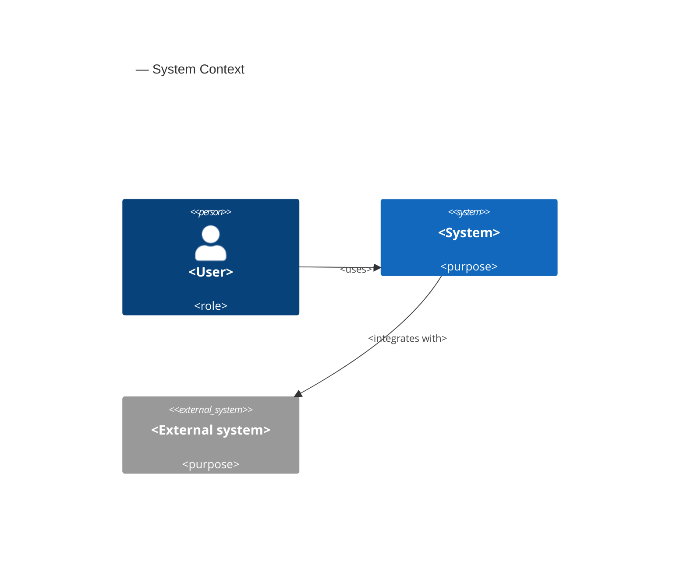
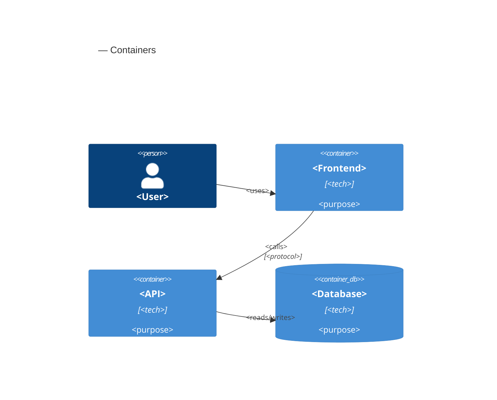
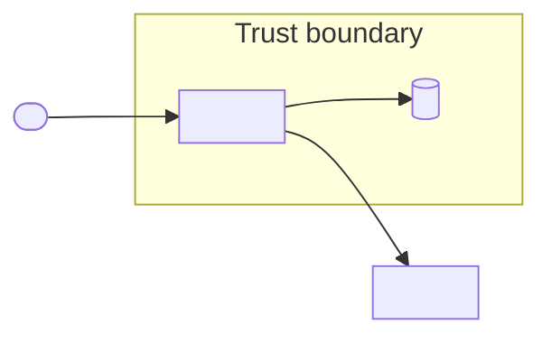

<!-- MODE-BANNER:START — optional orientation note (e.g. "This SAD owns the macro-architecture and AR-NNN"); leave as-is if unused -->
<!-- MODE-BANNER:END -->

# SAD: <System or Initiative Name>

## 1. Introduction

### Purpose

<State the purpose of this System Architecture Document and the system it describes.>

### Scope

<Define the macro-architecture this document covers and what it does not (code-level design lives in the SDD).>

### Audience

<Identify the readers: architects, engineering leads, security, platform, operations, product.>

### References

| Reference | Description | Link or Location |
| --- | --- | --- |
| PRD | Product Requirements Document | .product/prd/prd.md |
| SRS | Software Requirements Specification (if used) | .product/srs/srs.md |
| <Reference> | <Description> | <Link> |

### Related ADRs

- <ADR-NNN: Title>
- <ADR-NNN: Title>

### Glossary

| Term | Meaning |
| --- | --- |
| <Term> | <Definition> |

## 2. Architectural Drivers and Requirements

### Architectural Drivers

- <Driver 1, sourced from SRS/PRD non-functional requirements: scalability, reliability, security, cost, compliance, time-to-market>
- <Driver 2>

> AR/constraint IDs follow the [canonical ID conventions](../references/id-conventions.md).

### Architectural Requirements

| ID | Requirement | Source | Design Impact |
| --- | --- | --- | --- |
| AR-NNN | <Requirement> | <PRD/SRS/ADR/stakeholder> | <Impact> |
| AR-NNN | <Requirement> | <Source> | <Impact> |

### Technical Constraints

- <Constraint 1>
- <Constraint 2>

## 3. System Context

A high-level (C4 Level 1) view of how the system interacts with users and external third-party systems.

## 4. Container and Infrastructure

A C4 Level 2 view of the major containers, their technology choices, and the deployment landscape.

### Technology Choices

| Concern | Choice | Notes / linked ADR |
| --- | --- | --- |
| <Concern> | <Choice> | <ADR-NNN> |

## 5. Data Flow and Integration Patterns

Describe how containers communicate (REST / GraphQL / gRPC / async event-driven messaging) and how data moves between systems. Use a data-flow diagram with trust boundaries where privacy/security review warrants it.

## 6. Security and Compliance Architecture

Macro-level security posture (implementation-level controls live in SDD §8 Security and Compliance):

- **Authentication:** <model, e.g. OAuth2 / OIDC / JWT>
- **Authorization:** <coarse-grained model, e.g. RBAC at the gateway>
- **Encryption:** <in transit / at rest posture>
- **Network perimeters:** <segmentation, ingress/egress, trust zones>
- **Compliance boundaries:** <data residency, regulatory scope>

## 7. Architecture Decisions

Structural choices made in this SAD, each linking to its ADR for the rationale.

| Decision | Choice | Rationale (ADR) |
| --- | --- | --- |
| <Decision> | <Choice> | <ADR-NNN> |

## 8. Open Questions and Assumptions

| Item | Type | Owner | Status |
| --- | --- | --- | --- |
| <Assumption or question> | <Assumption/question> | <Owner> | <Open/resolved> |
